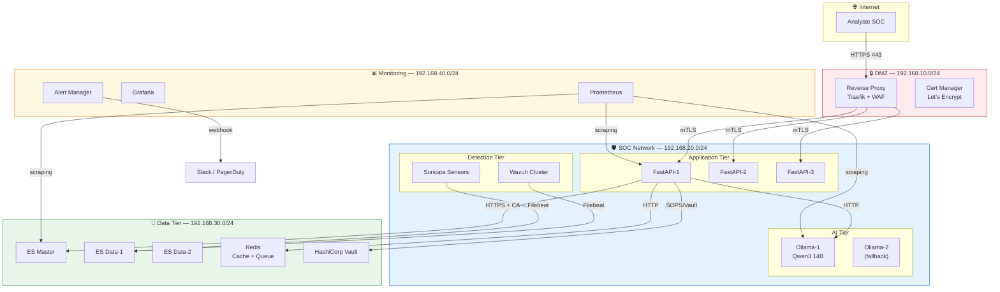
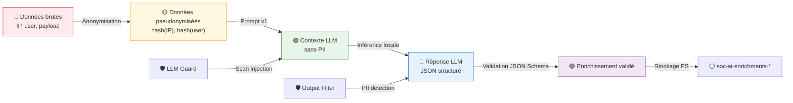
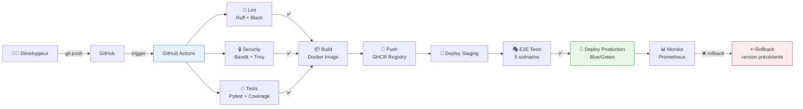

# Je vais structurer un document complet de recommandations production-ready
# en m'appuyant sur les 3 documents du PFA déjà analysés

## De MVP académique → Solution SOC déployable

---

# TABLE DES MATIÈRES

1. [Sécurité & Hardening](#1-sécurité--hardening)
2. [Réseau & Segmentation](#2-réseau--segmentation)
3. [Déploiement & CI/CD](#3-déploiement--cicd)
4. [Haute Disponibilité (HA)](#4-haute-disponibilité-ha)
5. [Monitoring & Observabilité](#5-monitoring--observabilité)
6. [Gouvernance des données & RGPD](#6-gouvernance-des-données--rgpd)
7. [Tests & Qualité](#7-tests--qualité)
8. [Documentation & Runbooks](#8-documentation--runbooks)
9. [Évaluation & Métriques SOC](#9-évaluation--métriques-soc)
10. [Évolutions V2-V3](#10-évolutions-v2-v3)

---

# 1. SÉCURITÉ & HARDENING

## 1.1 Authentification & Autorisation (RBAC)

### État actuel (MVP)
- FastAPI sans auth → **Toute personne sur le réseau 192.168.56.0/24 peut appeler l'API**
- ES avec user/password basique (`elastic:SocSiem2024!`)
- Pas de rôles, pas de sessions

### À implémenter

```python
# app/core/auth.py — JWT + RBAC
from fastapi import Depends, HTTPException, status
from fastapi.security import HTTPBearer, HTTPAuthorizationCredentials
from jose import JWTError, jwt
from passlib.context import CryptContext

# Rôles SOC
class Role(str, Enum):
    ANALYST_L1 = "analyst_l1"      # Vue lecture + enrichir ses incidents
    ANALYST_L2 = "analyst_l2"      # + remédier + assigner
    SOC_MANAGER = "soc_manager"    # + stats + config prompts
    ADMIN = "admin"                # + gestion utilisateurs

# JWT config
SECRET_KEY = os.getenv("JWT_SECRET_KEY")  # 256-bit minimum
ALGORITHM = "HS256"
ACCESS_TOKEN_EXPIRE_MINUTES = 480  # 8h shift

# Endpoints protégés
@app.post("/enrich/{alert_id}/explain")
async def enrich_explain(
    alert_id: str,
    current_user: User = Depends(require_role([Role.ANALYST_L1, Role.ANALYST_L2, Role.SOC_MANAGER]))
):
    ...
```

| Composant | Implémentation | Priorité |
|-----------|---------------|----------|
| JWT Auth | `fastapi-users` ou custom JWT | 🔴 Critique |
| RBAC | Décorateurs `@require_role()` | 🔴 Critique |
| MFA | TOTP (Google Authenticator) | 🟡 Important |
| Password policy | min 12 chars, 90j rotation | 🟡 Important |
| API Keys | Pour intégrations machine-to-machine | 🟡 Important |
| Audit log | Qui a fait quoi, quand | 🔴 Critique |

### Audit Trail — Schéma ES
```json
{
  "@timestamp": "2026-05-28T10:30:00Z",
  "event.action": "enrichment.triggered",
  "user.id": "analyst.martin",
  "user.role": "analyst_l2",
  "source.ip": "192.168.56.100",
  "target.alert_id": "wazuh-5763-abc",
  "target.enrichment_type": "explain",
  "result": "success",
  "enrichment_id": "enrich-xyz789",
  "latency_ms": 45000
}
```

---

## 1.2 Chiffrement & TLS

### État actuel
- ES en TLS avec certificats auto-signés partagés via `/vagrant/certs/`
- Communication inter-VM en clair (sauf ES)

### À implémenter

| Flux | État | Action |
|------|------|--------|
| FastAPI ↔ Client | HTTP | **TLS 1.3 + certificat valide** (Let's Encrypt interne ou PKI entreprise) |
| FastAPI ↔ ES | HTTPS + CA custom | ✅ OK, mais certificats à renouveler automatiquement |
| FastAPI ↔ Ollama | HTTP localhost | ✅ OK (localhost), mais binder sur Unix socket + permissions |
| Filebeat ↔ ES | HTTPS + CA custom | ✅ OK |
| Wazuh agents ↔ Manager | TCP 1514 encrypté | ✅ OK |
| Inter-VM traffic | Clair | **TLS mutuel (mTLS)** ou **VPN mesh** (WireGuard) |

### mTLS entre services
```yaml
# docker-compose.prod.yml (exemple futur)
services:
  fastapi:
    networks:
      - soc-ai-secure
    volumes:
      - ./certs/fastapi.crt:/certs/cert.pem
      - ./certs/fastapi.key:/certs/key.pem
      - ./certs/ca.crt:/certs/ca.pem
    environment:
      - TLS_CERT=/certs/cert.pem
      - TLS_KEY=/certs/key.pem
      - TLS_CA=/certs/ca.pem
      - VERIFY_CLIENT_CERT=true  # mTLS
```

---

## 1.3 Sécurité du LLM (LLM Security)

### Menaces identifiées

| Menace | Risque | Contre-mesure déjà en place | À ajouter |
|--------|--------|----------------------------|-----------|
| Prompt Injection | LLM exécute des instructions malveillantes | Bloc `<DATA>` séparé | **Input sanitization** + **LLM Guard** (détection d'injection) |
| Data Leakage | LLM révèle des données sensibles dans sa réponse | Inférence locale | **PII Detection** post-génération + **Output filtering** |
| Model Poisoning | Modèle compromis | Qwen3 officiel | **Hash vérification** du modèle + **Scan antivirus** |
| Denial of Wallet | Coût d'inférence explosif | Sémaphore=1 | **Rate limiting** par user + **Quota par shift** |
| Hallucination | Réponse fausse/confiance trompeuse | Validation JSON + schéma strict | **Confidence threshold** + **Human-in-the-loop** pour score > 85 |

### LLM Guard — Intégration recommandée
```python
# app/services/llm_guard.py
from llm_guard import scan_prompt, scan_output

class LlmGuard:
    def validate_input(self, prompt: str) -> tuple[bool, list[str]]:
        """Détecte injection, PII, toxicité dans le prompt"""
        result = scan_prompt(prompt)
        return result.is_safe, result.issues
    
    def validate_output(self, response: str) -> tuple[bool, list[str]]:
        """Détecte fuite de données, toxicité, incohérence"""
        result = scan_output(response)
        return result.is_safe, result.issues
```

---

## 1.4 Secrets Management

### État actuel
- `.env` fichier plat sur le filesystem
- Mots de passe en clair dans les scripts Vagrant

### À implémenter

```bash
# Option 1: HashiCorp Vault (enterprise)
vault kv put secret/soc-ai/fastapi \
  ES_HOST=192.168.56.20 \
  ES_PASS=<encrypted> \
  JWT_SECRET_KEY=<encrypted>

# Option 2: Docker Secrets (si conteneurisation)
echo "SocSiem2024!" | docker secret create es_password -

# Option 3: SOPS + Age (open source, recommandé pour PFA)
sops --encrypt --age $(cat age.pubkey) config/.env > config/.env.enc
# Déchiffrement au runtime
sops --decrypt config/.env.enc | source /dev/stdin
```

| Niveau | Solution | Complexité | Recommandation |
|--------|----------|-----------|----------------|
| Lab | `.env` + `.gitignore` | ⭐ | ✅ MVP |
| Staging | SOPS + Age | ⭐⭐ | ✅ Recommandé pour V2 |
| Production | HashiCorp Vault | ⭐⭐⭐⭐ | 🎯 Objectif long terme |

---

# 2. RÉSEAU & SEGMENTATION

## 2.1 Architecture réseau production

### État actuel (Lab)
```
Tout sur 192.168.56.0/24 (host-only)
├── Pas de segmentation
├── Pas de firewall inter-VM (sauf UFW basique)
└── Host a accès à tout
```

### Architecture cible (Production)

```
┌─────────────────────────────────────────────────────────────┐
│                    DMZ (192.168.10.0/24)                     │
│  ┌─────────────┐  ┌─────────────┐  ┌─────────────┐         │
│  │   Reverse   │  │   WAF       │  │   Bastion   │         │
│  │   Proxy     │  │   (ModSec)  │  │   (Jump)    │         │
│  │  (Traefik)  │  │             │  │             │         │
│  └──────┬──────┘  └──────┬──────┘  └─────────────┘         │
└─────────┼────────────────┼──────────────────────────────────┘
          │                │
          ▼                ▼
┌─────────────────────────────────────────────────────────────┐
│              SOC Network (192.168.20.0/24)                   │
│  ┌─────────────┐  ┌─────────────┐  ┌─────────────┐         │
│  │   FastAPI   │  │   Kibana    │  │   Ollama    │         │
│  │   :8000     │  │   :5601     │  │   :11434    │         │
│  └─────────────┘  └─────────────┘  └─────────────┘         │
│  ┌─────────────┐  ┌─────────────┐                           │
│  │   Wazuh     │  │   Suricata  │                           │
│  │   Manager   │  │   Sensor    │                           │
│  └─────────────┘  └─────────────┘                           │
└─────────────────────────────────────────────────────────────┘
          │
          ▼
┌─────────────────────────────────────────────────────────────┐
│           Management Network (192.168.30.0/24)               │
│  ┌─────────────┐  ┌─────────────┐  ┌─────────────┐         │
│  │   ES Cluster│  │   Vault     │  │   Monitoring│         │
│  │   :9200     │  │   :8200     │  │   (Prom/Grafana)      │
│  └─────────────┘  └─────────────┘  └─────────────┘         │
└─────────────────────────────────────────────────────────────┘
          │
          ▼
┌─────────────────────────────────────────────────────────────┐
│           Endpoint Network (VLAN isolés par site)            │
│  ┌─────────────┐  ┌─────────────┐  ┌─────────────┐         │
│  │   Endpoint  │  │   Endpoint  │  │   Endpoint  │         │
│  │   Site A    │  │   Site B    │  │   Site C    │         │
│  └─────────────┘  └─────────────┘  └─────────────┘         │
└─────────────────────────────────────────────────────────────┘
```

### Règles firewall (exemple UFW/iptables)

```bash
# VM-AI-01 (FastAPI)
ufw default deny incoming
ufw allow from 192.168.20.0/24 to any port 8000 proto tcp  # SOC network only
ufw allow from 192.168.30.0/24 to any port 22 proto tcp    # Management SSH
ufw deny from any to any port 11434                         # Ollama: localhost ONLY

# VM-ELK-01 (Elasticsearch)
ufw allow from 192.168.20.0/24 to any port 9200 proto tcp  # SOC services
ufw allow from 192.168.30.0/24 to any port 5601 proto tcp  # Management Kibana
ufw deny from any to any port 9200                          # Refuse reste
```

---

## 2.2 Reverse Proxy & WAF

```yaml
# traefik.yml (exemple)
api:
  dashboard: false  # Désactiver en prod

entryPoints:
  web:
    address: ":80"
    http:
      redirections:
        entryPoint:
          to: websecure
          scheme: https
  websecure:
    address: ":443"
    http:
      tls:
        certResolver: letsencrypt

providers:
  docker:
    exposedByDefault: false

# Rate limiting
middlewares:
  rate-limit:
    rateLimit:
      average: 10
      burst: 20
  
  # WAF basique
  sec-headers:
    headers:
      customResponseHeaders:
        X-Frame-Options: "DENY"
        X-Content-Type-Options: "nosniff"
        Content-Security-Policy: "default-src 'self'"
```

---

# 3. DÉPLOIEMENT & CI/CD

## 3.1 Conteneurisation (Docker)

### Pourquoi Docker maintenant ?
- MVP = VMs Vagrant (OK pour lab)
- Production = **Conteneurs** (portabilité, reproductibilité, scaling)

```dockerfile
# Dockerfile — FastAPI
FROM python:3.11-slim

# Security: non-root user
RUN groupadd -r socai && useradd -r -g socai socai

WORKDIR /app
COPY requirements.txt .
RUN pip install --no-cache-dir -r requirements.txt

COPY app/ ./app/
COPY config/ ./config/

# Healthcheck
HEALTHCHECK --interval=30s --timeout=10s --start-period=5s --retries=3 \
  CMD curl -f http://localhost:8000/health || exit 1

USER socai
EXPOSE 8000

CMD ["uvicorn", "app.main:app", "--host", "0.0.0.0", "--port", "8000"]
```

```dockerfile
# Dockerfile — Ollama (avec modèle pré-téléchargé)
FROM ollama/ollama:latest

# Pré-pull le modèle pour éviter le téléchargement au démarrage
RUN ollama serve & \
    sleep 5 && \
    ollama pull qwen3:14b && \
    pkill ollama

EXPOSE 11434
ENTRYPOINT ["ollama", "serve"]
```

---

## 3.2 Orchestration

| Environnement | Outil | Justification |
|---------------|-------|---------------|
| Lab (actuel) | Vagrant + VirtualBox | ✅ Simple, reproductible |
| Staging | Docker Compose | ➡️ Prochaine étape |
| Production | Kubernetes (K3s/RKE2) | ➡️ Objectif V3 |

```yaml
# docker-compose.yml (staging)
version: '3.8'

services:
  fastapi:
    build: ./app
    ports:
      - "8000:8000"
    environment:
      - ES_HOST=elasticsearch:9200
      - OLLAMA_HOST=ollama:11434
    depends_on:
      - elasticsearch
      - ollama
    restart: unless-stopped
    deploy:
      resources:
        limits:
          memory: 2G
        reservations:
          memory: 1G

  ollama:
    build: ./ollama
    volumes:
      - ollama-models:/root/.ollama
    deploy:
      resources:
        limits:
          memory: 12G  # Qwen3 14B + marge
        reservations:
          memory: 10G
    restart: unless-stopped

  elasticsearch:
    image: elasticsearch:8.12.0
    environment:
      - discovery.type=single-node
      - xpack.security.enabled=true
    volumes:
      - es-data:/usr/share/elasticsearch/data
    restart: unless-stopped

volumes:
  ollama-models:
  es-data:
```

---

## 3.3 CI/CD Pipeline

```yaml
# .github/workflows/ci.yml
name: CI/CD SOC-AI

on:
  push:
    branches: [main, develop]
  pull_request:
    branches: [main]

jobs:
  test:
    runs-on: ubuntu-latest
    steps:
      - uses: actions/checkout@v4
      
      - name: Setup Python
        uses: actions/setup-python@v5
        with:
          python-version: '3.11'
      
      - name: Install dependencies
        run: |
          pip install -r app/requirements.txt
          pip install pytest pytest-asyncio pytest-cov
      
      - name: Lint
        run: |
          pip install ruff black
          ruff check app/
          black --check app/
      
      - name: Security scan
        run: |
          pip install bandit safety
          bandit -r app/
          safety check
      
      - name: Unit tests
        run: pytest tests/ --cov=app --cov-report=xml
      
      - name: Upload coverage
        uses: codecov/codecov-action@v3

  build:
    needs: test
    runs-on: ubuntu-latest
    steps:
      - uses: actions/checkout@v4
      
      - name: Build Docker image
        run: docker build -t soc-ai-fastapi:${{ github.sha }} ./app
      
      - name: Scan image
        uses: aquasecurity/trivy-action@master
        with:
          image-ref: soc-ai-fastapi:${{ github.sha }}
          format: 'sarif'
          output: 'trivy-results.sarif'
      
      - name: Push to registry
        run: |
          echo ${{ secrets.REGISTRY_TOKEN }} | docker login ghcr.io -u ${{ github.actor }} --password-stdin
          docker tag soc-ai-fastapi:${{ github.sha }} ghcr.io/${{ github.repository }}/fastapi:latest
          docker push ghcr.io/${{ github.repository }}/fastapi:latest
```

---

# 4. HAUTE DISPONIBILITÉ (HA)

## 4.1 Elasticsearch Cluster

### État actuel
- Single node sur VM-ELK-01 → **SPOF (Single Point of Failure)**

### Architecture cible

```
┌─────────────────────────────────────────────┐
│         Elasticsearch Cluster (3 nodes)      │
│                                              │
│  ┌─────────────┐  ┌─────────────┐           │
│  │  ES-Master  │  │  ES-Data-1  │           │
│  │  (voting)   │  │  (hot)      │           │
│  └─────────────┘  └─────────────┘           │
│  ┌─────────────┐  ┌─────────────┐           │
│  │  ES-Data-2  │  │  ES-Data-3  │           │
│  │  (warm)     │  │  (cold)     │           │
│  └─────────────┘  └─────────────┘           │
│                                              │
│  ILM: Hot (7j) → Warm (30j) → Cold (90j)   │
└─────────────────────────────────────────────┘
```

---

## 4.2 FastAPI — Scaling horizontal

```python
# app/main.py — Statelessness pour scaling
from fastapi import FastAPI
import redis

# Cache distribué (vs cache mémoire actuel)
redis_client = redis.Redis.from_url(os.getenv("REDIS_URL", "redis://localhost:6379"))

# Dedup distribué
dedup = DistributedDedup(redis_client, ttl=1800)  # 30min

# Sessionless: tout dans JWT ou ES
# → Permet de scaler FastAPI sur plusieurs instances
```

```yaml
# docker-compose.scale.yml
services:
  fastapi:
    deploy:
      replicas: 3
      resources:
        limits:
          memory: 2G
    environment:
      - REDIS_URL=redis://redis:6379
```

---

## 4.3 Ollama — HA du LLM

| Option | Avantage | Inconvénient |
|--------|----------|--------------|
| **Load Balancer + 2x Ollama** | Redondance | Coût mémoire doublé (2x 14GB) |
| **vLLM + GPU** | Meilleure perf, multi-requêtes | Nécessite GPU |
| **Fallback API externe** | 100% uptime | Fuite de données possible |

**Recommandation V2 :** vLLM sur GPU avec batching + queue (Celery/Redis)

---

# 5. MONITORING & OBSERVABILITÉ

## 5.1 Stack Monitoring (Prometheus + Grafana)

```yaml
# prometheus.yml
scrape_configs:
  - job_name: 'fastapi'
    static_configs:
      - targets: ['fastapi:8000']
    metrics_path: '/metrics'  # Prometheus client
    
  - job_name: 'elasticsearch'
    static_configs:
      - targets: ['elasticsearch:9200']
    
  - job_name: 'ollama'
    static_configs:
      - targets: ['ollama:11434']
```

### Métriques clés à exposer

| Métrique | Type | Seuil d'alerte |
|----------|------|----------------|
| `llm_requests_total` | Counter | — |
| `llm_latency_seconds` | Histogram | P95 > 90s |
| `llm_errors_total` | Counter | Rate > 5% |
| `enrichment_cache_hit_ratio` | Gauge | < 30% (cache inefficace) |
| `es_query_duration_seconds` | Histogram | P95 > 2s |
| `fastapi_active_connections` | Gauge | > 50 |
| `ollama_gpu_memory_usage` | Gauge | > 90% |

### Dashboard Grafana (mockup)

```
┌─────────────────────────────────────────────────────────────┐
│  SOC-AI Dashboard                    [🟢 Healthy]           │
├─────────────────────────────────────────────────────────────┤
│  ┌─────────────┐  ┌─────────────┐  ┌─────────────┐         │
│  │ Enrichments │  │ Avg Latency │  │ Cache Hit   │         │
│  │   1,247     │  │   45s       │  │   68%       │         │
│  │  ↑ 12%      │  │  ↓ 8s       │  │  ↑ 5%       │         │
│  └─────────────┘  └─────────────┘  └─────────────┘         │
│                                                             │
│  [Graphique: Latence LLM sur 24h]                          │
│  ═══════════════════════════════════════                    │
│                                                             │
│  [Graphique: Répartition par type d'enrichissement]        │
│  ████ explain ███ investigate ██ remediate                  │
│                                                             │
│  [Table: Top 10 incidents par score de risque]             │
│  │ INC-001 │ SSH Brute │ 94 │ CRITICAL │ 2h ago │         │
│  │ INC-002 │ File Mod  │ 87 │ HIGH     │ 3h ago │         │
└─────────────────────────────────────────────────────────────┘
```

---

## 5.2 Logging centralisé (ELK déjà en place → enrichir)

```python
# app/core/logging.py — Structured JSON logs
import structlog
import logging

structlog.configure(
    processors=[
        structlog.processors.TimeStamper(fmt="iso"),
        structlog.processors.add_log_level,
        structlog.processors.dict_tracebacks,
        structlog.processors.JSONRenderer()
    ],
    wrapper_class=structlog.make_filtering_bound_logger(logging.INFO),
    context_class=dict,
    logger_factory=structlog.PrintLoggerFactory()
)

logger = structlog.get_logger()

# Usage
logger.info(
    "enrichment.completed",
    enrichment_id="enrich-abc",
    alert_id="wazuh-5763",
    latency_ms=45000,
    validated=True,
    risk_score=78
)
```

---

## 5.3 Alerting (PagerDuty/Opsgenie/Slack)

```python
# app/services/alerting_service.py
class AlertingService:
    SEVERITY_THRESHOLDS = {
        "critical": 0.95,  # ES down, LLM OOM
        "warning": 0.85,   # Latence élevée
        "info": 0.70       # Cache hit faible
    }
    
    async def check_health(self):
        health = await self.get_system_health()
        if health < self.SEVERITY_THRESHOLDS["critical"]:
            await self.send_alert("CRITICAL", "System unhealthy", channels=["pagerduty", "slack"])
```

---

# 6. GOUVERNANCE DES DONNÉES & RGPD

## 6.1 Classification des données

| Type de donnée | Exemple | Classification | Rétention |
|----------------|---------|----------------|-----------|
| Alertes brutes | `source.ip`, `user.name` | **Confidentiel** | 90 jours |
| Enrichissements | Explications LLM, requêtes KQL | **Interne** | 1 an |
| Logs d'audit | `user.id`, `action`, `timestamp` | **Réglementé** | 3 ans |
| Prompts LLM | Données contextuelles | **Confidentiel** | 30 jours |

## 6.2 Anonymisation / Pseudonymisation

```python
# app/services/anonymization.py
import hashlib
from cryptography.fernet import Fernet

class DataAnonymizer:
    def __init__(self, key: bytes):
        self.cipher = Fernet(key)
    
    def pseudonymize_ip(self, ip: str) -> str:
        """Conserve la corrélation mais masque l'IP réelle"""
        return hashlib.sha256(f"{ip}{self.salt}".encode()).hexdigest()[:16]
    
    def encrypt_sensitive(self, value: str) -> str:
        """Chiffrement réversible pour les données à restituer"""
        return self.cipher.encrypt(value.encode()).decode()
    
    def anonymize_for_llm(self, alert: dict) -> dict:
        """Prépare une alerte pour le LLM sans fuite de données"""
        return {
            "timestamp": alert["timestamp"],
            "severity": alert["severity"],
            "rule_name": alert["rule_name"],
            "source_ip_hash": self.pseudonymize_ip(alert["source_ip"]),
            "user_hash": self.pseudonymize_ip(alert["user"]) if alert.get("user") else None,
            # PAS de données brutes sensibles
        }
```

## 6.3 Droit à l'oubli

```python
# Endpoint pour suppression RGPD
@app.delete("/gdpr/data/{subject_id}")
async def delete_subject_data(
    subject_id: str,
    current_user: User = Depends(require_role([Role.ADMIN]))
):
    """
    Supprime toutes les données liées à un sujet (IP, user, host)
    - Alertes ES (avec reindex)
    - Enrichissements
    - Logs d'audit
    - Cache dedup
    """
    await es_repository.delete_by_query(f"source.ip:{subject_id} OR user.name:{subject_id}")
    await audit_log("gdpr.deletion", subject_id=subject_id, user=current_user.id)
    return {"status": "deleted", "subject_id": subject_id}
```

---

# 7. TESTS & QUALITÉ

## 7.1 Pyramide des tests

```
         /\\
        /  \\
       / E2E \\      ← 5 scénarios (S1-S5) — déjà en place
      /────────\\
     / Integration\\  ← API + ES + Ollama (testcontainers)
    /──────────────\\
   /    Unit        \\ ← Services isolés (pytest + mocks)
  /──────────────────\\
 /   Static Analysis  \\ ← Ruff, Bandit, MyPy
/────────────────────────\\
```

## 7.2 Tests d'intégration (manquants)

```python
# tests/integration/test_enrichment_flow.py
import pytest
from testcontainers.elasticsearch import ElasticSearchContainer
from testcontainers.ollama import OllamaContainer

@pytest.fixture
def es_client():
    with ElasticSearchContainer("elasticsearch:8.12.0") as es:
        yield es.get_client()

@pytest.fixture
def ollama_client():
    with OllamaContainer("qwen3:14b") as ollama:
        yield ollama.get_client()

async def test_end_to_end_enrichment(es_client, ollama_client):
    # 1. Injecter une alerte Wazuh
    alert = create_test_alert(severity=12, mitre_id="T1110")
    await index_alert(es_client, alert)
    
    # 2. Appeler l'API
    response = await client.post(f"/enrich/{alert['id']}/explain")
    
    # 3. Vérifier
    assert response.status_code == 200
    assert response.json()["validated"] == True
    assert response.json()["risk_score"] > 70
    assert "explanation" in response.json()["response"]
    
    # 4. Vérifier persistance
    enrichments = await es_client.search(index="soc-ai-enrichments-*")
    assert enrichments["hits"]["total"]["value"] == 1
```

## 7.3 Performance Testing

```python
# tests/perf/test_load.py
import locust

class SocAiUser(locust.HttpUser):
    wait_time = locust.between(1, 5)
    
    @locust.task(3)
    def list_incidents(self):
        self.client.get("/incidents?hours=24&limit=50")
    
    @locust.task(1)
    def enrich_alert(self):
        self.client.post(f"/enrich/{random_alert_id()}/explain")
    
    @locust.task(1)
    def get_enrichment(self):
        self.client.get(f"/enrichments/{random_enrichment_id()}")
```

**Objectifs de performance :**
| Endpoint | Cible | Seuil critique |
|----------|-------|----------------|
| GET /incidents | < 500ms | > 2s |
| POST /enrich | < 90s (P95) | > 150s |
| GET /health | < 100ms | > 500ms |
| Concurrent users | 10 | > 20 (sémaphore LLM) |

---

# 8. DOCUMENTATION & RUNBOOKS

## 8.1 Documentation obligatoire

| Document | Audience | Contenu |
|----------|----------|---------|
| **Architecture Decision Records (ADR)** | Équipe technique | Pourquoi chaque choix (Wazuh vs OSSEC, Ollama vs API, etc.) |
| **Runbook: Incident LLM timeout** | SOC L1 | Que faire quand Ollama ne répond pas |
| **Runbook: Faux positif massif** | SOC L2 | Comment ajuster le scoring |
| **API Reference** | Développeurs | OpenAPI/Swagger auto-généré |
| **User Guide Analyste** | SOC Analysts | Comment utiliser l'UI, interpréter les enrichissements |
| **Deployment Guide** | DevOps | Docker, K8s, variables d'env |

## 8.2 Runbook exemple — LLM Timeout

```markdown
# RUNBOOK: LLM Timeout / Ollama Unresponsive

## Symptômes
- POST /enrich retourne 504
- /health indique "ollama: down"
- Grafana: llm_latency_seconds P95 > 90s

## Diagnostic (1 min)
1. SSH VM-AI-01
2. `systemctl status ollama` → doit être "active"
3. `dmesg | grep -i "killed process"` → OOM ?
4. `ollama list` → modèle présent ?
5. `curl http://localhost:11434/api/tags` → répond ?

## Actions
| Cas | Action |
|-----|--------|
| Ollama down | `sudo systemctl restart ollama` |
| OOM (dmesg) | Augmenter RAM VM-AI-01 OU passer à qwen3:8b |
| Modèle manquant | `ollama pull qwen3:14b` |
| Disque plein | `df -h` → nettoyer logs |

## Escalade
Si non résolu en 10 min → Page SOC Manager + L2
```

---

# 9. ÉVALUATION & MÉTRIQUES SOC

## 9.1 Métriques d'efficacité opérationnelle (OKR)

| Objectif | KPI | Baseline | Cible V2 | Cible V3 |
|----------|-----|----------|----------|----------|
| Réduire MTTR | Temps moyen de résolution | 45 min | 25 min | 15 min |
| Réduire MTTC | Temps moyen de compréhension | 12 min | 5 min | 3 min |
| Qualité enrichissement | Taux de validation JSON | 85% | 92% | 95% |
| Adoption analyste | % alertes enrichies | 30% | 60% | 80% |
| Réduction fatigue | Alertes fermées sans action | 40% | 25% | 15% |
| Coût inférence | Latence P95 | 90s | 30s (GPU) | 10s (GPU) |

## 9.2 Protocole d'évaluation amélioré

```
PHASE 1 — Baseline (2 semaines)
├── Mesurer MTTC sans enrichissement
├── 20 analystes, 200 alertes
└── Métriques: temps, erreurs d'interprétation, escalades

PHASE 2 — A/B Test (4 semaines)
├── Groupe A: 50% analystes → enrichissement activé
├── Groupe B: 50% analystes → mode contrôle (alertes brutes)
└── Métriques: même + satisfaction (questionnaire)

PHASE 3 — Déploiement généralisé
├── Tous les analystes
├── Mesure continue via telemetry
└── Retrospective mensuelle
```

---

# 10. ÉVOLUTIONS V2-V3

## 10.1 Roadmap produit

```
2026 Q1 — V1.0 MVP (actuel)
├── 3 enrichissements (explain, investigate, remediate)
├── UI vanilla
├── Ollama CPU
└── Single node

2026 Q2 — V1.5 Hardening
├── Auth JWT + RBAC
├── TLS mTLS
├── Audit logs
├── Secrets management (SOPS)
└── Docker Compose

2026 Q3 — V2.0 Intelligence
├── Chat NL libre
├── Rapports automatiques
├── Timeline interactive
├── Multi-modèle (fallback GPT-4 pour cas complexes)
└── vLLM + GPU

2026 Q4 — V2.5 Scale
├── K8s (K3s)
├── ES cluster 3 nodes
├── FastAPI répliqué
├── Redis distributed cache
└── Prometheus/Grafana

2027 Q1 — V3.0 Autonomie
├── Enrichissement automatique (pas juste on-demand)
├── Playbooks auto-triggered
├── Corrélation ML (pas juste temporelle)
├── Threat Intelligence integration (MISP)
└── SOC metrics dashboard
```

## 10.2 Features V2 détaillées

### Chat NL libre
```python
# POST /chat
{
  "message": "Montre-moi les incidents SSH des dernières 24h avec score > 80",
  "session_id": "sess-abc"
}

# Réponse
{
  "type": "query_result",
  "kql": "event.category:authentication AND source.ip:* AND risk_score:>80",
  "summary": "3 incidents trouvés, 1 critique",
  "results": [...]
}
```

### Rapports automatiques
- Daily digest: top 10 incidents, tendances, nouvelles règles déclenchées
- Weekly report: métriques MTTR, qualité enrichissements, couverture MITRE
- Monthly: posture sécurité, recommandations

### Timeline interactive
```
[Timeline INC-001 — SSH Brute Force]
10:00:00 ── Suricata alert 9000001 (source: 192.168.56.100)
10:00:03 ── Wazuh auth_fail (user: root, source: 192.168.56.100)
10:00:05 ── Wazuh auth_fail (user: admin, source: 192.168.56.100)
10:00:12 ── Wazuh rule 5763 triggered (SSH brute force)
10:00:15 ── [ENRICHMENT] explain generated (score: 78, high)
10:00:45 ── [ENRICHMENT] remediate: block_source_ip suggested
10:01:00 ── [ACTION] Analyste L2 approved → IP blocked
```

---

# SYNTHÈSE — Checklist Production-Ready

## 🔴 Critique (bloquant mise en prod)

- [ ] Authentification JWT + RBAC
- [ ] Audit logs (qui fait quoi)
- [ ] TLS 1.3 sur toutes les communications externes
- [ ] Secrets management (pas de .env en clair)
- [ ] Input/output sanitization LLM
- [ ] Rate limiting + quotas
- [ ] Health checks + readiness probes
- [ ] Backup ES (snapshots)
- [ ] Runbooks (LLM timeout, ES down, etc.)

## 🟡 Important (à implémenter rapidement)

- [ ] Docker + Docker Compose
- [ ] CI/CD (GitHub Actions)
- [ ] Monitoring Prometheus/Grafana
- [ ] Alerting (Slack/PagerDuty)
- [ ] Tests d'intégration (testcontainers)
- [ ] Performance testing (Locust)
- [ ] Anonymisation données sensibles
- [ ] Documentation API (OpenAPI)

## 🟢 Souhaitable (V2-V3)

- [ ] Kubernetes
- [ ] ES Cluster HA
- [ ] vLLM + GPU
- [ ] Chat NL libre
- [ ] Rapports auto
- [ ] Multi-modèle fallback
- [ ] Threat Intel (MISP)
- [ ] SOC metrics dashboard

---

# DIAGRAMMES SUPPLÉMENTAIRES

## D1. Architecture sécurisée (production)



## D2. Flux de sécurité (data flow sécurisé)



## D3. CI/CD Pipeline


